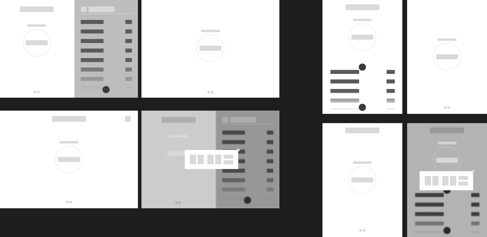
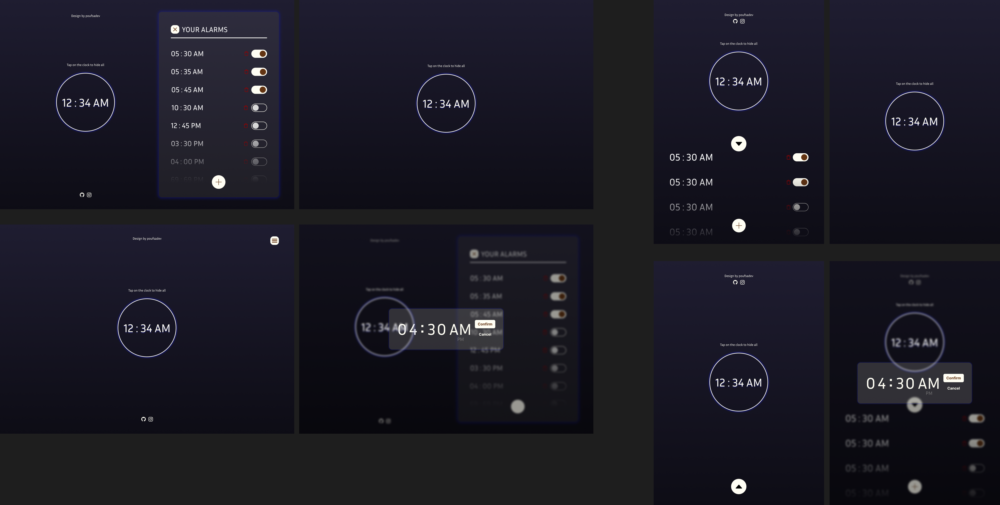

# adz-pp-clock-timer

A simple practice of designing by creating an alarm clock interface with responsiveness for mobile devices upto 500px.

# Technologies used
- Figma
- HTML
- CSS
- JavaScript

# Low Fidelity Design

# High Fidelity Design

# Purpose
This is done to understand certain aspects of CSS and basic JavaScript scripting.

# Notes
- There are no validations in input
- There are certain rough animations
